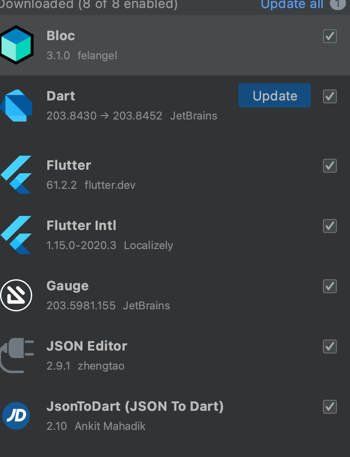
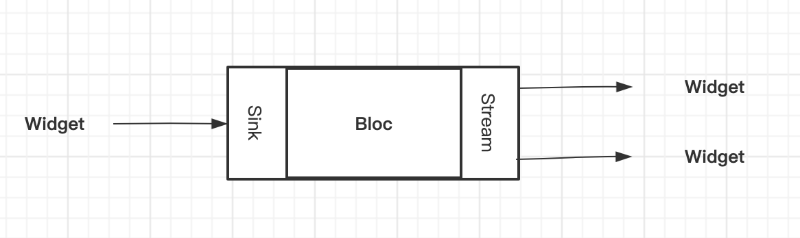
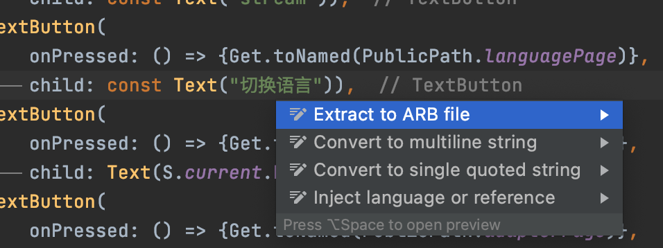
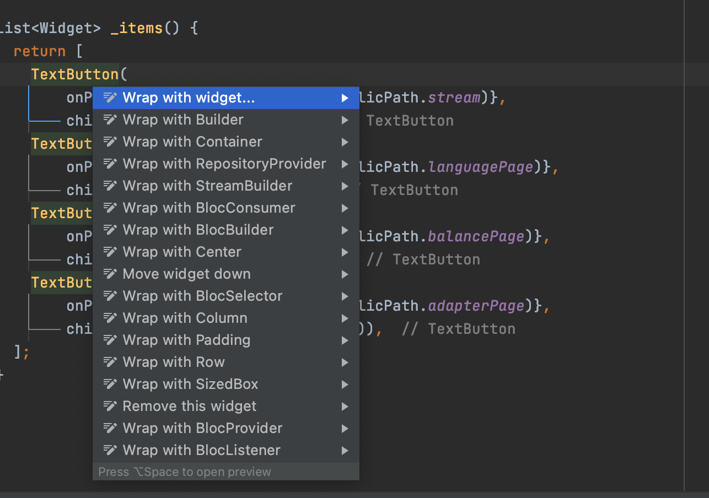
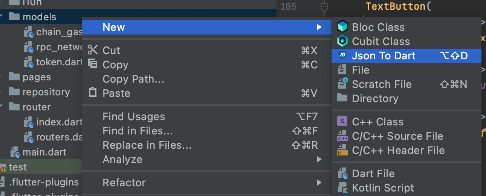
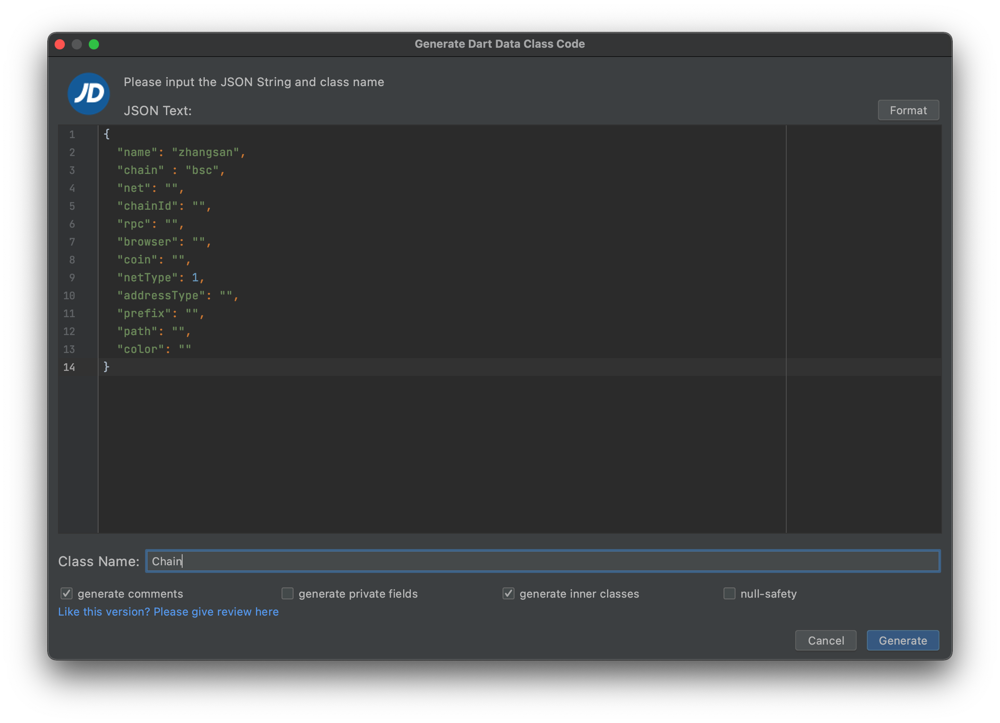

### 开发准备：

环境：
```
Android studio
Xcode
Flutter 2.5.3
Fvm latest
```
备注： 
- 考虑到Android studio 比 Vscoode对Flutter 比较友好
- 并且为了避免代码格式化不统一情况，全部采用Android studio，废弃Vscode 编程


插件：

```
Bloc
Dart
Flutter
Flutter Intl
JSON Editor
JsonToDart
```




### 模板使用Bloc（Business Logic Component） MVVM响应式编程架构.

主要解决以下问题：

- 1、业务逻辑和UI组件糅合在一起。
- 2、不方便测试，不利于单独的测试业务逻辑部分。
- 3、不能更好的重用业务逻辑代码

### 如何用BloC模式

Bloc 主要流程是，数据展示、发送事件、处理事件、展示数据。示意图如下：



Bloc 工作核心是StreamController，有广播和单订阅

广播：
```
StreamController _broadcastController = StreamController.broadcast();

_streamSubscription1 =  _broadcastController.stream.listen((event) {
      debugPrint("=========订阅数据1。。。" + event);
    });
_streamSubscription2 = _broadcastController.stream.listen((event) {
      debugPrint("=========订阅数据2。。。" + event);
    });

```

单订阅：

```
StreamController _streamController = StreamController();

_streamSubscription3 = _streamController.stream.listen((event) {
      debugPrint("=========订阅数据3。。。" + event);
    });
```

具体可以看考 [./lib/pages/stream/stream_page.dart](./lib/pages/stream/stream_page.dart)

备注：
- 1、如果单订阅订阅了多次，就会有下面报错：

```
======== Exception caught by widgets library =======================================================
The following StateError was thrown building Builder:
Bad state: Stream has already been listened to.
```
- 2、订阅结束取消监听：

```
  @override
  void dispose() {
    _streamSubscription1.cancel();
    _streamSubscription2.cancel();
    _streamSubscription3.cancel();
    super.dispose();
  }
```

### 开发效率提升

#### 一键生成国际化
- 唤起命令  将鼠标光标放置字符串上 alt(option) + enter 健



#### 一键操作小组件
- 唤起命令 将鼠标光标放置任意小组件上 alt(option) + enter 健


#### 数据模型生成

- 选择数据模型目录 右键选择JSONToDart
- 将JSON数据复制到Text 输入框内,输入类名称
- 勾选generate comments、generate innner classes 
- 点击 generate 生成数据模型文件




### 模板目录
```
.
├── README.md      
├── android 安卓工程目录
├── build   flutter 构建目录
├── ios     iOS工程目录
├── lib     flutter 业务目录
│   ├── bloc       业务逻辑管理目录
│   │   ├── chain  链相关
│   │   ├── main   主要（一般是全局业务）
│   │   ├── setting 设置
│   │   └── stream  流事件业务
│   ├── chain       链相关辅助工具
│   │   ├── ether.dart
│   │   ├── filecoin.dart
│   │   └── provider.dart
│   ├── config      配置项
│   │   ├── config.dart
│   │   └── constant.dart
│   ├── data       数据管理中心
│   │   └── storage_manager.dart
│   ├── generated    国际化文件
│   ├── l10n         国际化文件
│   ├── main.dart    工程主文件
│   ├── models       工程数据模型
│   │   ├── chain_gas.dart
│   │   ├── rpc_network.dart
│   │   └── token.dart
│   ├── pages        工程页面
│   │   ├── adapter
│   │   ├── balance
│   │   ├── language
│   │   └── stream
│   ├── repository   工程api交互
│   │   ├── http     http 请求
│   │   └── web3     web3请求
│   └── router
│       ├── index.dart 路由配置
│       └── routers.dart 路由路径
├── pubspec.yaml       三方库管理

```
